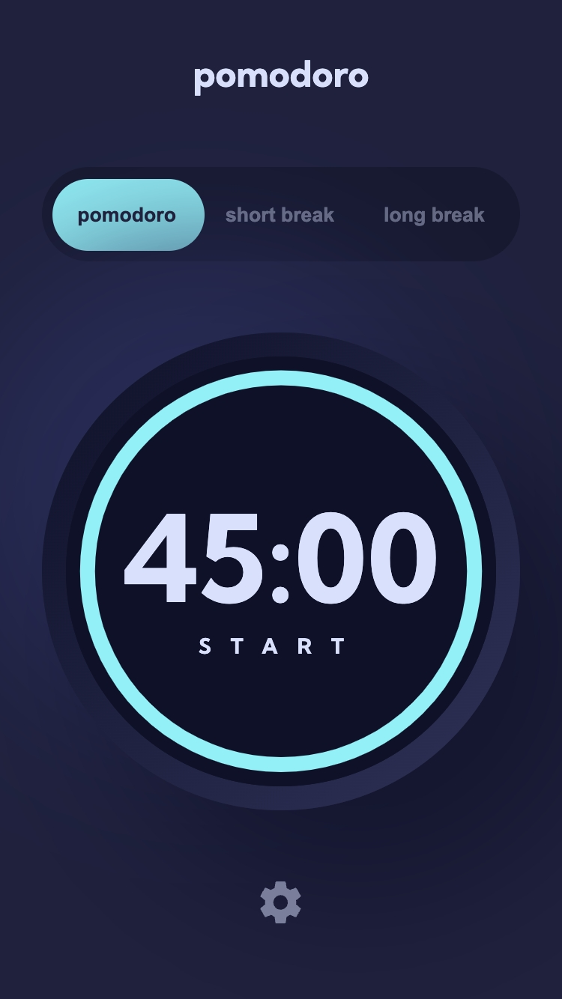
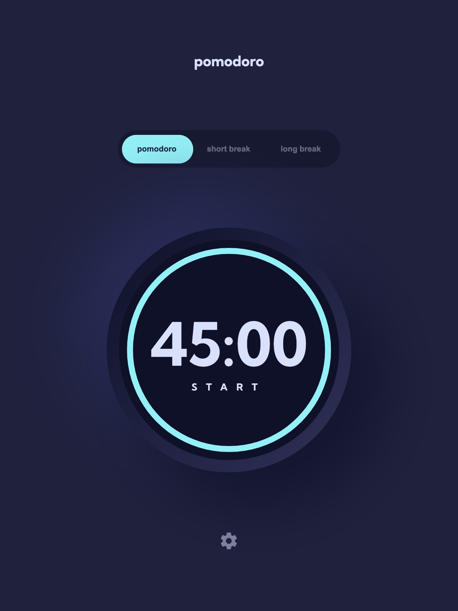
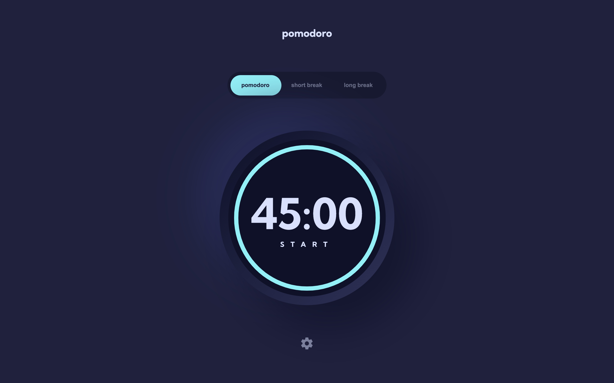

# Frontend Mentor - Pomodoro app solution

This is a solution to the [Pomodoro app challenge on Frontend Mentor](https://www.frontendmentor.io/challenges/pomodoro-app-KBFnycJ6G). Frontend Mentor challenges help you improve your coding skills by building realistic projects.

## Table of contents

- [Overview](#overview)
  - [The challenge](#the-challenge)
  - [Screenshots](#screenshots)
  - [Links](#links)
- [My process](#my-process)
  - [Built with](#built-with)
- [Author](#author)

## Overview

### The challenge

Users should be able to:

- Set a pomodoro timer and short & long break timers
- Customize how long each timer runs for
- See a circular progress bar that updates every minute and represents how far through their timer they are
- Customize the appearance of the app with the ability to set preferences for colors and fonts

### Screenshots

### Links

- Solution URL: [https://github.com/hatealgebra/pomodoro-app-FEM](https://github.com/hatealgebra/pomodoro-app-FEM)
- Live Site URL: [https://pomodoro-hatealgebra.netlify.app](https://pomodoro-hatealgebra.netlify.app)

## My process

### Built with

- Semantic HTML5 markup
- CSS custom properties
- Flexbox
- CSS Grid
- Mobile-first workflow
- [React](https://reactjs.org/) - JS library
- [Linaria](https://linaria.dev) - For styling

## Author

- Website - [pavel-vondra.com](https://www.pavel-vondra.com)
- Frontend Mentor - [@hatealgebra](https://www.frontendmentor.io/profile/hatealgebra)
